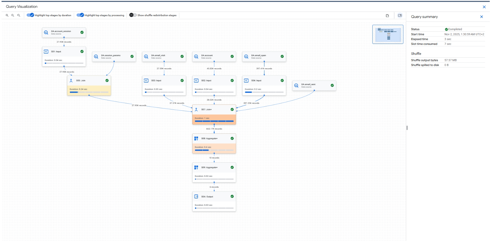
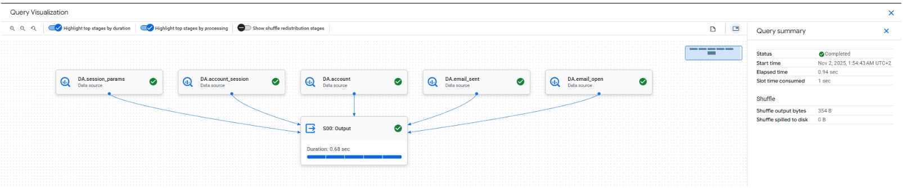

# Email Metrics Query Optimization (BigQuery)

## Goal
Оптимізувати запит, що рахує email-метрики в розрізі операційних систем, та порівняти Execution Details до і після змін.

Метрики:
- sent_msg
- open_msg
- visit_msg
- open_rate
- click_rate
- CTOR

Фільтр: тільки активні підписники (`is_unsubscribed = 0`)

---

## Problem in Original Query

Початковий запит:
- Містив вкладені підзапити з `SELECT *`
- Створював проміжні великі таблиці
- Використовував зайві JOIN-и
- Ускладнював execution plan

Це призводило до:
- Більшого обсягу оброблених даних
- Довшого execution time
- Вищого slot consumption

---

## Optimization Approach

Було зроблено:

- Видалено вкладені `SELECT *`
- Використано прямі JOIN-и між таблицями
- Спрощено структуру запиту
- Додано `SAFE_DIVIDE()` для уникнення ділення на 0
- Додано `ROUND(..., 2)` для коректного форматування метрик

---

## Before / After (Execution Details)

### Before Optimization
- Elapsed time: 3 sec  
- Slot time consumed: ~7.6 sec  
- Shuffle output bytes: 57.57 MB  
- Shuffle spilled to disk: 0 B  

---

### After Optimization
- Elapsed time: 0.94 sec  
- Slot time consumed: ~1 sec  
- Shuffle output bytes: 354 B  
- Shuffle spilled to disk: 0 B  

---

## Performance Impact

Although the total bytes processed remained the same (same source tables were scanned),
the execution performance significantly improved:

- Slot time reduced from ~7.6 sec to ~1 sec
- Execution time reduced from 3 sec to under 1 sec
- Shuffle output reduced from 57.57 MB to 354 B

The main performance improvement came from:
- Removing nested subqueries (`SELECT *`)
- Eliminating unnecessary intermediate result sets
- Simplifying JOIN structure
- Reducing data reshuffling between execution stages

---

## Tech Skills Demonstrated
- Query optimization
- Execution plan analysis
- BigQuery performance tuning
- Join simplification
- SAFE_DIVIDE usage
